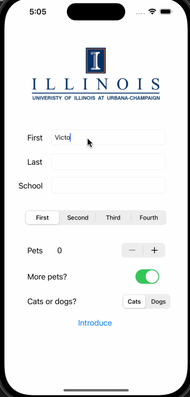

## My First iOS App!

### App Description:

This is a basic app that takes in a person's first name, last name, school they attend, school year, number of pets they own, if they want more pets, and whether they prefer cats or dogs, and creates an introduction based on those fields.

### App Walk-though

### Required Features:

- [X] 1. App displays an image of a school's logo
- [X] 2. App has three textfields for first, last, and school names
- [X] 3. App has a segmented control that changes student year
- [X] 4. Number of pet matches label is increased/decreased by stepper
- [X] 5. Switch makes a statement about wanting more pets or not(true/false) 
- [X] 6. Introduce yourself button shows alert box with an introduction and dismiss button

### Optional Features

- [ ] 1. User can tap a button to change the color of the background view
- [X] 3. User can select on additional buttons that provide more info about the user. Example: more textfields, a different alert box, etc.
- [ ] 4. Any stylistic changes that are not default options (Comment this here)
